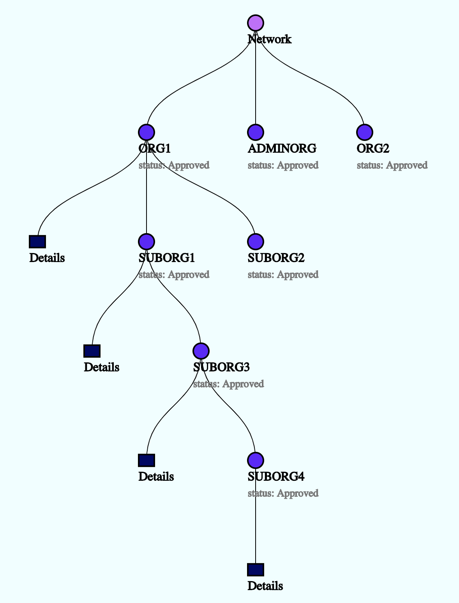

# Enhanced Permissions Model

The Enhanced Permissions Model caters for enterprise-level needs by having a smart contract-based permissioning model.
This allows for significant flexibility to manage nodes, accounts, and account-level access controls.

An overview of the model is as depicted below:
  

### Key Definitions

* Network - A set of interconnected nodes representing an enterprise blockchain which contains organizations
* Organization - A set of roles, Ethereum accounts and nodes having a variety of permissions to interact with the network
* Sub Organization - Further sub-grouping within the Organization as per business needs
* Account - An Ethereum account which is an EOA (Externally Owned Account)
* Voter - An account capable of voting for a certain action
* Role - A named job function in an organization
* Node - A `geth` node which is part of the network and belongs to an organization or sub organization

As depicted above, in the enhanced permissions model, the network comprises a group of organizations.
The network admin accounts defined at network level can propose and approve new organizations to join
the network, and can assign an account as the organization administration account. The organization admin
account can create roles, create sub organizations, assign roles to its accounts, and add any other node 
which is part of the organization. A sub organization can have its own set of roles, accounts and 
suborganizations. The organization administration account manages and controls all activities at the 
organization level. The organization administrator can create an admin role and assign the same to a
different account to manage the administration of a sub organization. The access rights of an account
are derived based on the role assigned to it. The account will be able to transact via any node linked to
the sub org or at overall organizations level.  

A sample network view is as depicted below:

