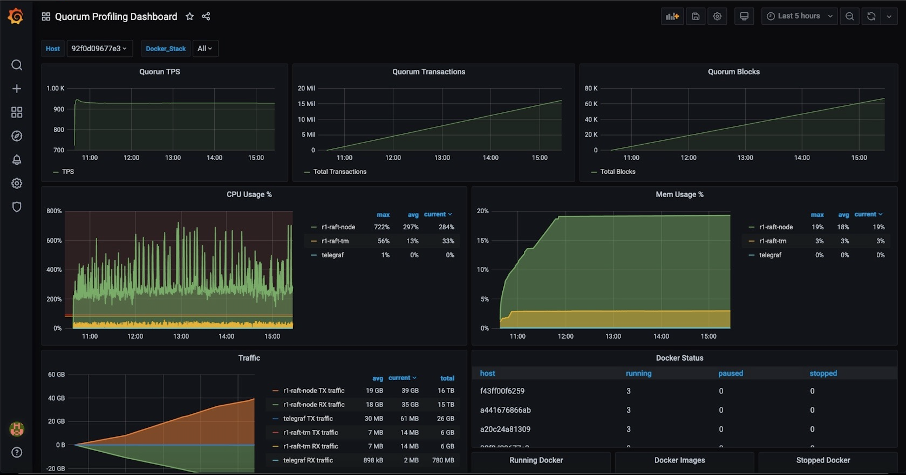

# Quorum Profiling

[Quorum Profiling](https://github.com/jpmorganchase/quorum-profiling) is a custom toolset which could be used to benchmark transaction throughput and network statistics on any existing Quorum network using the [Jmeter](https://github.com/jpmorganchase/quorum-profiling/tree/master/jmeter-test) & [TPS monitoring](https://github.com/jpmorganchase/quorum-profiling/tree/master/tps-monitor) tool profiles. Alternatively it could also be used to spin up an entire quorum network from scratch in AWS and benchmark the network for TPS, CPU/Memory usage. The various scenarios of usage is explained [here](https://github.com/jpmorganchase/quorum-profiling)

## Metrics Visualisation

Key Components:

- [Telegraf](https://hub.docker.com/_/telegraf) - plugin-driven server agent for collecting and reporting metrics. Refer to Quorum Profilings config [here](https://github.com/jpmorganchase/quorum-profiling/blob/master/scripts/telegraf/telegraf.conf).
- [JMeter](https://jmeter.apache.org) - Load testing tool. The detail of various profiles and test execution, please refer [here](https://github.com/jpmorganchase/quorum-profiling/tree/master/jmeter-test)
- [TPS Monitor](https://github.com/jpmorganchase/quorum-profiling/tree/master/tps-monitor) - Custom "go" project to monitor transactions per second, total transactions and total blocks in Quorum network. 
- [InfluxDB](https://www.influxdata.com/time-series-platform/influxdb/) - Open source time series database for monitoring metrics and events, providing real-time visibility.
- [Prometheus](https://prometheus.io) - similar to influx prometheus records real-time metrics in a time series database built using a HTTP "pull" model, with flexible queries and real-time alerting
- [Grafana](https://grafana.com) - Monitoring tool for metrics and logs consolidation

The tool executes the stress test profile selected and then collects the following metrics:

 * CPU/Memory usage for both `Quorum` & `tessera`
 * Transaction & Block count
 * Transaction processing speed
 * `Jmeter` test execution statistics

 These metrics could be configured to be stored in an InfluxDB or Prometheus for further analysis. Both databases integrate well with the open source dashboard editor Grafana to allow for easy creation of dashboards to visualise the data being captured from the profiling tool. Sample dashboards below:

### Sample Network Dashboard 

 

### Sample JMeter Dashboard

 
