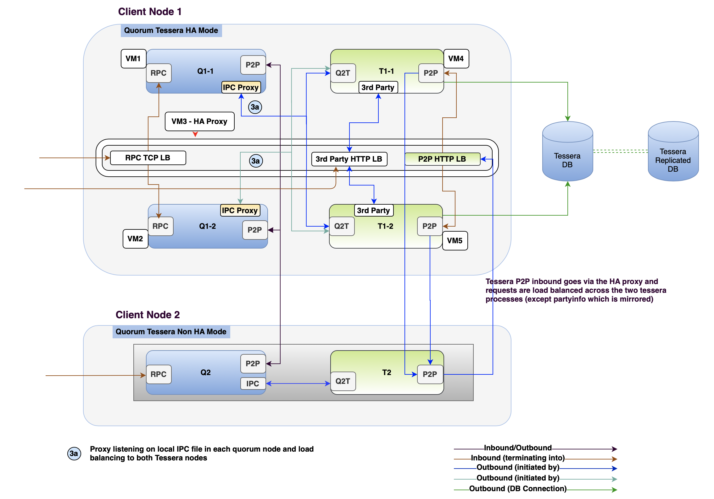
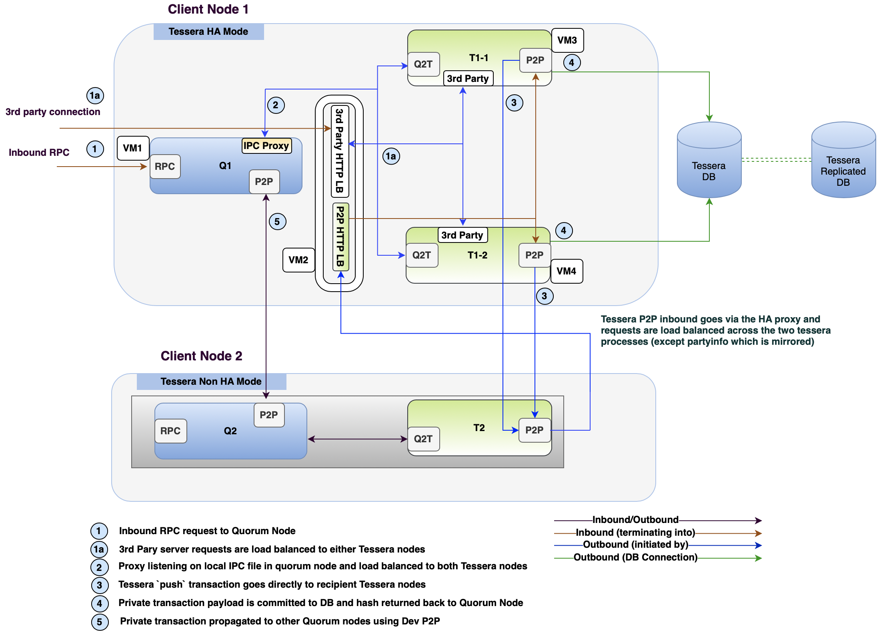

# GoQuorum high availability

GoQuorum architecture allows for end to end high availability on various i/o operations to fulfill security
and compliance requirements. In this section we will go through an example configuration and setup:

!!!warning
    Below high availability setup is an example of how to achieve end to end high availability
    using proxy server but it should be noted that this hasn't been tested in a production environment setup.

## GoQuorum Node Configuration Requirements

- Two or more GoQuorum Nodes serve as one client node.
- The inbound RPC requests from clients will be load balanced to one of these Quorum nodes.
- These nodes will need to share same key for transaction signing and should have shared access to key store directory or key vaults.
- These nodes need to share the same private state. They could either connect to local Tessera node or
    in full HA setup using [proxy](#proxy-setup-on-both-quorum-nodes) running on each GoQuorum node
    listening on local IPC socket and directing request to Tessera Q2T HTTP but in both cases the Tessera node(s) share the same database.

## Tessera Node Configuration Requirements

- Separate [Proxy](#standalone-proxy-server-setup) server to redirect/mirror requests to two or more Tessera nodes
- Two or more Tessera Nodes serve as Privacy manager for Client GoQuorum node.
- These nodes share same public/private key pair (stored in password protected files or external vaults) and share same database.
- In the server configuration, the `bindingAddress` should be the local addresses (their real addresses), but `advertisedAddress` (`serverAddress`) needs to be configured to be the proxy.
- Add DB replication or mirroring for Tessera private data store and the JDBC connection string to include both Primary DB and DR DB connections to facilitate auto switchover on failure.

??? info "Quorum HA Setup 1"
    **Quorum Tessera pair share same machine/container in this setup**
    

??? info "Quorum Full HA Setup "

    - **The change here is each Quorum and Tessera node run in separate machine/container**
    - **Proxy running on each Quorum node to listen on local ipc file and load balance request to both Tessera nodes**
    

??? info "Tessera HA Setup "
    **If HA is required only for Tessera, below setup could be adopted**
    

## Example Setup using Nginx Proxy setup

### Proxy Setup on both Quorum nodes

```c
       load_module /usr/lib/nginx/modules/ngx_stream_module.so;
       error_log /home/ubuntu/nginx-error.log;
       events { }
       http {
           # Quorum-to-Tessera http
           upstream q2t {
                   server url1:port1;
                   server url2:port2;
               }
           server {
                   listen unix:/home/ubuntu/tm.ipc;
                   location / {
                           # Below is added to avoid transaction failure if partyinfo gets out of sync.
                           proxy_next_upstream error timeout http_404 non_idempotent;
                           proxy_pass http://q2t;
                   }
           }
       }
```

### Standalone Proxy server setup

```c

    load_module /usr/lib/nginx/modules/ngx_stream_module.so;

    error_log /home/ubuntu/nginx-error.log;
    events { }
    stream {
    #Quorum json-rpc
        upstream quorum {
                server url1:port1;
                server url2:port2 backup;
        }
        server {
                listen 22000;
                proxy_pass quorum;
        }
      }
    http {

        # Third-party server
        upstream thirdparty {
                server url1:port1;
                server url2:port2;
        }
        server {
                listen 9081;
                location / {
                        proxy_next_upstream error timeout http_404 non_idempotent;
                        proxy_pass http://thirdparty;
                }
        }
        # Peer-to-peer server
        upstream p2p {
                server url1:port1;
                server url2:port2;
        }
        upstream p2p-mirror {
                server url1:port1;
                server url2:port2 backup;
        }
        server {
                listen 9001;

                location /resend {
                        proxy_pass http://p2p/resend;
                }
                location /push {
                        proxy_pass http://p2p/push;
                }
                location /partyinfo {
                        mirror /partyinfo-mirror;
                        proxy_pass http://p2p-mirror/partyinfo;
                }
                location /partyinfo-mirror {
                        internal;
                        proxy_pass url2:port2/partyinfo;
                }
                location /partyinfo/validate {
                        proxy_pass http://p2p/partyinfo/validate;
                }
                location /upcheck {
                        proxy_pass http://p2p/upcheck;
      }}}
```

*[HA]: High Availability
*[Q2T]: Quorum-to-Tessera
